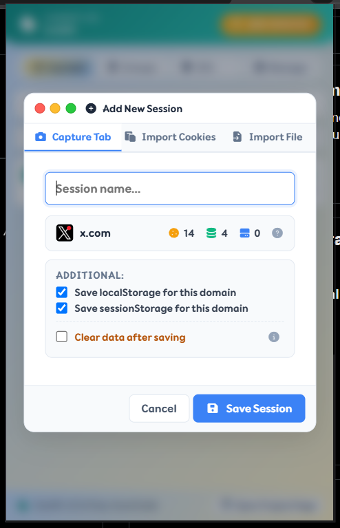
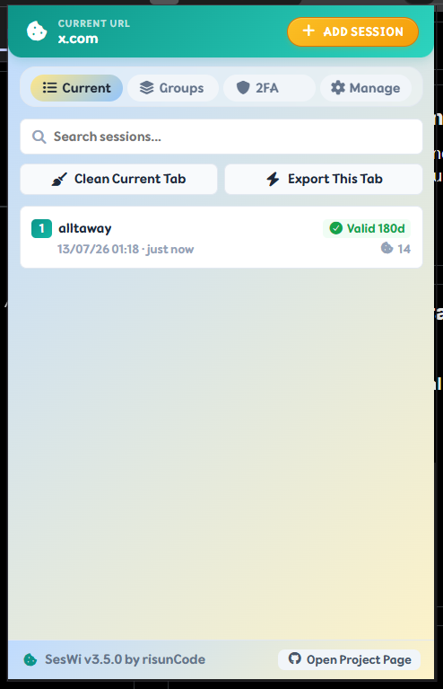
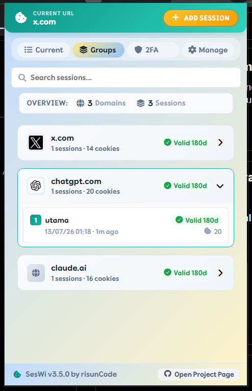
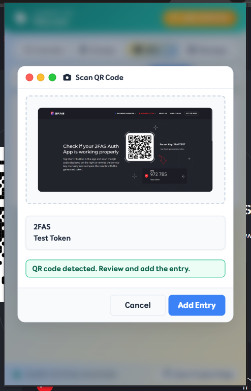
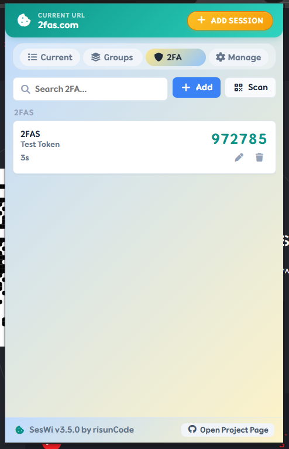
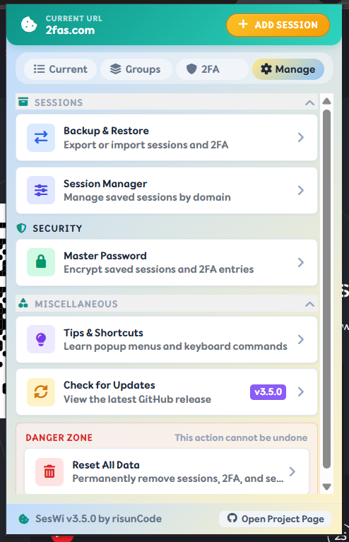

# SesWi — Session Manager

SesWi is a Chrome and Firefox extension for saving, restoring, and organizing browser login sessions. A session captures cookies, `localStorage`, and `sessionStorage` for a domain; SesWi also includes a TOTP 2FA vault, encrypted OWI backups, tab cleanup, and Master Password protection.

Built with **WXT, Vue 3, and TypeScript**.

## Features

- Save and restore sessions for the active domain.
- Capture cookies, `localStorage`, and `sessionStorage` together.
- Browse sessions by domain and manage them in bulk.
- Store TOTP 2FA secrets, generate live codes, and add entries from QR scans.
- Import cookies and sessions from JSON, Netscape, Cookie header, key-value text, and OWI files.
- Create encrypted **OWI** backups or raw JSON backups.
- Protect local SesWi data with a Master Password, five-minute remembered unlock, fast lock, and recovery flow.
- Clean cookies and browser storage for the current tab.
- Export current-tab data without saving a session.
- Use a Tampermonkey or Violentmonkey helper to request confirmed SesWi actions.

## v4.0.0 Highlights

- **One modern manifest target:** Chrome and Firefox now ship as Manifest V3 builds. Firefox uses `.output/firefox-mv3`, the MV3 `action` API, and its persistent MV3 background page.
- **Faster, safer popup startup:** the popup has a loading shell, defers non-critical update checks, and lazy-loads heavyweight modal chunks without exposing protected content while locked.
- **Clear Current Tab with intent:** Site Data groups cookies, local/session storage, history, and cache; Window provides a separate, confirmed **Clear Other Tabs** action that keeps the active tab open.
- **Focused session and security flows:** saved session data opens in a dedicated detail modal, grouped views stay compact until expanded, and long Groups/2FA lists scroll instead of clipping data.
- **Portable 2FA intake:** add a Base32 secret manually, scan an OTPAuth QR code, or import Aegis JSON (including password-protected exports), Google Authenticator account-transfer migration URIs, and standard OTPAuth URI lists from tools such as Bitwarden and Ente.
- **Reliable local protection:** OWI imports, encrypted writes, current-tab cleanup, and Firefox cookie handling report real failures rather than false success.

## Showcase

| Add Session | Current Tab | Groups |
| --- | --- | --- |
|  |  |  |
| **Capture complete tab state** | **Manage the active domain** | **Browse sessions by domain** |

| QR Scan | Two-Factor Vault | Manage |
| --- | --- | --- |
|  |  |  |
| **Add TOTP from a QR code** | **Generate live TOTP codes** | **Control data and security** |

## Keyboard Shortcuts

| Shortcut | Action |
| --- | --- |
| `Ctrl+N` | Open Add Session |
| `Ctrl+X` | Open Clean Current Tab |
| Double `Ctrl+X` | Fast clean the current tab |
| `Ctrl+D` | Fast lock SesWi when Master Password is enabled |
| `Alt+Q` | Open SesWi from anywhere; press again while the popup is focused to close it |

Use **Current → Clean Current Tab → Clear Other Tabs** to close every other tab in the current window while keeping the active tab open.

## Userscript Bridge Workaround

The bridge is an optional workaround rather than a popup feature. Install [`app/public/userscripts/seswi-bridge-helper.user.js`](app/public/userscripts/seswi-bridge-helper.user.js) in Tampermonkey or Violentmonkey while SesWi is installed.

The helper exposes:

```js
window.SesWiBridge.saveCurrentDomain();
window.SesWiBridge.restoreLatestSession();
window.SesWiBridge.cleanCurrentTab();
```

It also registers matching userscript menu commands.

### Boundaries

- SesWi performs the actual cookie and storage work; the helper is a request bridge, not a replacement session engine.
- Every request requires an explicit confirmation in the SesWi popup.
- When Master Password is enabled, SesWi must be unlocked before an action can be approved.
- Restore uses the latest saved session for the current domain.
- The bridge does not read or write Tampermonkey or Violentmonkey internal storage.
- Complex SSO and auth-heavy sites can still require a refresh or manual retry after restore.

## Install

```bash
npm install
npm run build:chrome
```

Open `chrome://extensions`, enable **Developer mode**, then load:

```txt
.output/chrome-mv3
```

For Firefox:

```bash
npm run build:firefox
```

Load:

```txt
.output/firefox-mv3
```

## Development

```bash
npm run dev          # Chrome development mode
npm run dev:firefox  # Firefox development mode
npm test             # Vitest suite
npm run lint         # ESLint
npm run type-check   # TypeScript check
npm run build:chrome # Chrome production build
npm run build:firefox # Firefox production build
```

## Project Layout

```txt
app/
├── entrypoints/       # WXT bridges: popup, background, recovery, offscreen, userscript
├── background/        # Runtime coordination and browser commands
├── popup/             # Vue popup, tabs, modals, controls, and UI tests
├── forgot-password/   # Full-page Master Password recovery
├── features/          # Sessions, security, backup, import, 2FA, updates, userscript actions
├── platform/          # Browser adapters
├── shared/            # Shared contracts, normalization, validation, and helpers
├── styles/            # Global design primitives
└── public/            # Static extension assets
```

For contributor conventions, see [AGENTS.md](AGENTS.md).

## Roadmap

- **Cloud Backup & Restore** — optional sync/storage provider support.
- **UI Polishing** — continued work on spacing, states, animations, and consistency.
- **i18n Localization** — prepare UI copy for multiple languages.

## Credits

- [WXT](https://wxt.dev/)
- [Vue](https://vuejs.org/)
- [jsQR](https://github.com/cozmo/jsQR)
- [Font Awesome](https://fontawesome.com/)

Built by [risunCode](https://github.com/risunCode). MIT licensed.
